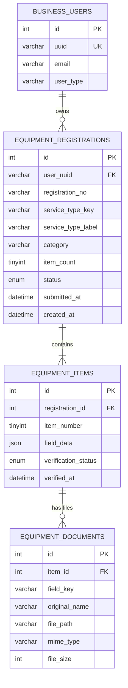

# Equipment Registration — Backend Data Strategy

## 1. Current State of Affairs

### What we have today

| Layer | What exists | Notes |
|-------|-------------|-------|
| **Frontend** | 27 service-type forms, config-driven wizard, `service-types.ts` constants | All fields are defined in `equipment-form-configs.ts` |
| **Backend framework** | CodeIgniter 4, MySQL (`new_osa` DB), JWT auth | Business users in `business_users` table, linked via `uuid` |
| **Existing equipment-like tables** | `fuel_pump_applications`, `weighing_instruments`, `capacity_measure_instruments`, `meter_instruments` | These are for **Pattern Approval** (different module), NOT for business equipment registration |
| **Business tables** | `business_users`, `business_owner_infos`, `business_contact_infos` | Business identity already established |

### The core question

> *We have 27 different service types, each with its own unique set of fields. How do we persist this data?*

---

## 2. The Two Architectural Options

### Option A: One Table Per Service Type (27 tables)

```
equipment_fuel_pumps         → pumpName, serialNumber, product, stickerNumber, sealNumber, ...
equipment_weighbridges       → weighbridgeName, location, maxCapacity, minCapacity, ...
equipment_fixed_storage_tanks → tankNumber, product, tankCapacity, ...
... (× 27)
```

**Pros:**
- Each table has strongly typed, named columns
- Easy SQL queries: `SELECT * FROM equipment_fuel_pumps WHERE user_uuid = ?`
- Standard relational approach

**Cons:**
- 27 tables to create, 27 models, 27 separate migration files
- Adding a new service type = new migration + model + controller method
- Many tables will have very similar columns (serialNumber, stickerNumber, sealNumber, status appear in almost all)
- Hard to query across types (e.g., "show me ALL equipment for this business")

---

### Option B: Shared Header Table + JSON Details (⭐ Recommended)

```
equipment_registrations      → id, user_uuid, service_type_key, status, ...
equipment_items              → id, registration_id, item_number, field_data (JSON), ...
equipment_documents          → id, item_id, field_key, file_path, ...
```

**Pros:**
- Only 3 tables for ALL 27 service types
- Adding a new service type = zero database changes (just add a frontend config)
- Single query to list all equipment: `SELECT * FROM equipment_registrations WHERE user_uuid = ?`
- The JSON `field_data` column stores the service-specific fields — validated by the frontend config
- MySQL 8+ has native JSON functions (`JSON_EXTRACT`, `JSON_SEARCH`) for querying inside JSON

**Cons:**
- Can't enforce column-level NOT NULL in the DB for service-specific fields (validation moves to app layer)
- Slightly more complex queries for specific fields

---

## 3. Recommended Schema — Option B

### Why Option B wins for this project

1. **Your frontend is already config-driven.** The `EQUIPMENT_FORM_CONFIGS` object defines all 27 forms. The backend should mirror this philosophy — the config IS the schema.
2. **27 tables is unsustainable.** Each new service type the WMA adds would require a database migration, a new PHP Model, and controller changes. With Option B, it's zero backend work.
3. **Cross-type queries are essential.** The "My Equipments" page needs to show ALL equipment types in a single list. With separate tables, you'd need 27 UNION queries or a complex aggregation.
4. **Your existing codebase uses this pattern.** The `pattern_application_instruments` table already stores instrument-specific data in a similar flexible way.

---

## 4. Table Designs

### Table 1: `equipment_registrations` (The header/parent)

One row per registration submission. A business owner registers "3 Fuel Pumps" → 1 row here.

```sql
CREATE TABLE `equipment_registrations` (
  `id`               INT UNSIGNED NOT NULL AUTO_INCREMENT,
  `user_uuid`        VARCHAR(32)  NOT NULL,                   -- FK → business_users.uuid
  `registration_no`  VARCHAR(50)  DEFAULT NULL,               -- Auto: EQR-2026-00001
  `service_type_key` VARCHAR(50)  NOT NULL,                   -- 'fuel-pump', 'weighbridge', etc.
  `service_type_label` VARCHAR(255) NOT NULL,                 -- 'Fuel Pump', 'Weighbridge', etc.
  `category`         VARCHAR(20)  NOT NULL,                   -- 'petroleum','weighing','length','metering','other'
  `item_count`       TINYINT UNSIGNED NOT NULL DEFAULT 1,     -- How many items in this registration
  `status`           ENUM('draft','pending','verified','rejected')
                     NOT NULL DEFAULT 'draft',
  `submitted_at`     DATETIME     DEFAULT NULL,
  `verified_at`      DATETIME     DEFAULT NULL,
  `verifier_id`      INT          DEFAULT NULL,
  `verifier_notes`   TEXT         DEFAULT NULL,
  `created_at`       DATETIME     DEFAULT CURRENT_TIMESTAMP,
  `updated_at`       DATETIME     DEFAULT CURRENT_TIMESTAMP ON UPDATE CURRENT_TIMESTAMP,
  PRIMARY KEY (`id`),
  KEY `idx_user`     (`user_uuid`),
  KEY `idx_service`  (`service_type_key`),
  KEY `idx_status`   (`status`),
  KEY `idx_category` (`category`)
) ENGINE=InnoDB DEFAULT CHARSET=utf8mb4 COLLATE=utf8mb4_unicode_ci;
```

### Table 2: `equipment_items` (The detail rows)

One row per individual equipment item. "3 Fuel Pumps" → 3 rows here.

```sql
CREATE TABLE `equipment_items` (
  `id`               INT UNSIGNED NOT NULL AUTO_INCREMENT,
  `registration_id`  INT UNSIGNED NOT NULL,                   -- FK → equipment_registrations.id
  `item_number`      TINYINT UNSIGNED NOT NULL DEFAULT 1,     -- 1, 2, 3...
  `field_data`       JSON         NOT NULL,                   -- All service-specific fields
  `verification_status` ENUM('pending','verified','rejected') NOT NULL DEFAULT 'pending',
  `verified_at`      DATETIME     DEFAULT NULL,
  `verifier_notes`   TEXT         DEFAULT NULL,
  `created_at`       DATETIME     DEFAULT CURRENT_TIMESTAMP,
  `updated_at`       DATETIME     DEFAULT CURRENT_TIMESTAMP ON UPDATE CURRENT_TIMESTAMP,
  PRIMARY KEY (`id`),
  KEY `idx_registration` (`registration_id`),
  CONSTRAINT `fk_items_registration`
    FOREIGN KEY (`registration_id`) REFERENCES `equipment_registrations`(`id`)
    ON DELETE CASCADE
) ENGINE=InnoDB DEFAULT CHARSET=utf8mb4 COLLATE=utf8mb4_unicode_ci;
```

### Table 3: `equipment_documents` (File uploads)

One row per uploaded file. Keeps binary file references separate from JSON data.

```sql
CREATE TABLE `equipment_documents` (
  `id`               INT UNSIGNED NOT NULL AUTO_INCREMENT,
  `item_id`          INT UNSIGNED NOT NULL,                   -- FK → equipment_items.id
  `field_key`        VARCHAR(50)  NOT NULL,                   -- Which form field this file belongs to
  `original_name`    VARCHAR(255) NOT NULL,
  `file_path`        VARCHAR(500) NOT NULL,                   -- Server path: uploads/equipment/...
  `mime_type`        VARCHAR(100) DEFAULT NULL,
  `file_size`        INT UNSIGNED DEFAULT NULL,               -- Bytes
  `created_at`       DATETIME     DEFAULT CURRENT_TIMESTAMP,
  PRIMARY KEY (`id`),
  KEY `idx_item`     (`item_id`),
  CONSTRAINT `fk_docs_item`
    FOREIGN KEY (`item_id`) REFERENCES `equipment_items`(`id`)
    ON DELETE CASCADE
) ENGINE=InnoDB DEFAULT CHARSET=utf8mb4 COLLATE=utf8mb4_unicode_ci;
```

---

## 5. How `field_data` JSON Works

When the frontend submits a **Fuel Pump** registration, the JSON stored in `equipment_items.field_data` would look like:

```json
{
  "pumpName": "Forecourt Pump FP-01",
  "serialNumber": "SN-12345",
  "product": "diesel",
  "stickerNumber": "STK-6789",
  "sealNumber": "SEAL-001",
  "sealSerialNumber": "SS-001",
  "pumpType": "electronic",
  "nozzleCount": "4",
  "status": "verified",
  "inspectionReport": "All nozzles pass accuracy test…",
  "verificationDate": "2026-03-15",
  "nextVerificationDate": "2027-03-15"
}
```

For a **Weighbridge**, the same column stores different fields:

```json
{
  "weighbridgeName": "WB-Main Gate",
  "location": "Main Entrance",
  "maxCapacity": "60000",
  "minCapacity": "500",
  "scaleDivision": "20 kg",
  "serialNumber": "SN-WB-001",
  "stickerNumber": "STK-WB-001",
  "sealNumber": "SEAL-WB-001",
  "lastCalibrationDate": "2026-01-10",
  "nextCalibrationDate": "2027-01-10",
  "status": "verified"
}
```

### Querying inside JSON (MySQL 8+)

```sql
-- Find all fuel pumps with product = diesel
SELECT ei.*, er.service_type_label
FROM equipment_items ei
JOIN equipment_registrations er ON er.id = ei.registration_id
WHERE er.service_type_key = 'fuel-pump'
  AND JSON_UNQUOTE(JSON_EXTRACT(ei.field_data, '$.product')) = 'diesel';

-- Find ALL equipment for a business owner  
SELECT er.service_type_label, er.status, er.category,
       ei.item_number, ei.field_data, ei.verification_status
FROM equipment_registrations er
JOIN equipment_items ei ON ei.registration_id = er.id
WHERE er.user_uuid = 'abc123'
ORDER BY er.created_at DESC;
```

---

## 6. API Design

### Endpoints to create

| Method | Route | Purpose |
|--------|-------|---------|
| `POST`   | `/api/business/equipments` | Submit a new equipment registration |
| `GET`    | `/api/business/equipments` | List all registrations for current user |
| `GET`    | `/api/business/equipments/:id` | Get registration detail with items |
| `PUT`    | `/api/business/equipments/:id` | Update a draft registration |
| `DELETE` | `/api/business/equipments/:id` | Delete a draft registration |
| `POST`   | `/api/business/equipments/:id/documents` | Upload a file for an item |

### POST payload example (frontend sends this)

```json
{
  "serviceTypeKey": "fuel-pump",
  "serviceTypeLabel": "Fuel Pump",
  "category": "petroleum",
  "items": [
    {
      "pumpName": "Forecourt Pump FP-01",
      "serialNumber": "SN-12345",
      "product": "diesel",
      "stickerNumber": "STK-6789",
      "sealNumber": "SEAL-001",
      "sealSerialNumber": "SS-001",
      "pumpType": "electronic",
      "nozzleCount": "4",
      "status": "verified"
    },
    {
      "pumpName": "Forecourt Pump FP-02",
      "serialNumber": "SN-12346",
      "product": "petrol",
      "stickerNumber": "STK-6790",
      "sealNumber": "SEAL-002",
      "sealSerialNumber": "SS-002",
      "pumpType": "mc-(mechanical-counter)",
      "nozzleCount": "2",
      "status": "pending"
    }
  ]
}
```

### Backend saves it as

```
equipment_registrations:
  id=1, user_uuid='abc', service_type_key='fuel-pump', category='petroleum', item_count=2, status='pending'

equipment_items:
  id=1, registration_id=1, item_number=1, field_data='{ "pumpName": "Forecourt Pump FP-01", ... }'
  id=2, registration_id=1, item_number=2, field_data='{ "pumpName": "Forecourt Pump FP-02", ... }'
```

---

## 7. Backend Files to Create

### New Files

| File | Purpose |
|------|---------|
| `app/Models/EquipmentRegistrationModel.php` | Model for `equipment_registrations` |
| `app/Models/EquipmentItemModel.php` | Model for `equipment_items` |
| `app/Models/EquipmentDocumentModel.php` | Model for `equipment_documents` |
| `app/Controllers/Api/BusinessEquipmentController.php` | REST controller |
| `app/Database/Migrations/2026-04-08-xxx_CreateEquipmentTables.php` | Migration for all 3 tables |

### Route additions (`app/Config/Routes.php`)

```php
// Business Equipment Registration
$routes->group('business/equipments', ['filter' => 'auth'], function($routes) {
    $routes->get('', 'BusinessEquipmentController::index');
    $routes->post('', 'BusinessEquipmentController::create');
    $routes->get('(:num)', 'BusinessEquipmentController::show/$1');
    $routes->put('(:num)', 'BusinessEquipmentController::update/$1');
    $routes->delete('(:num)', 'BusinessEquipmentController::delete/$1');
    $routes->post('(:num)/documents', 'BusinessEquipmentController::uploadDocument/$1');
});
```

---

## 8. Entity Relationship Diagram



---

## 9. Validation Strategy

Since field-level validation can't be enforced by the DB schema (the fields are inside JSON), validation happens in **two layers**:

| Layer | What it validates |
|-------|-------------------|
| **Frontend** (already built) | Required fields, field types, formats — driven by `EQUIPMENT_FORM_CONFIGS` |
| **Backend controller** | 1. `service_type_key` must be one of the 27 known keys. 2. `items` array must not be empty. 3. Each item's JSON is stored as-is (frontend is the source of truth for field shapes). 4. File uploads are validated for type/size. |

> [!TIP]
> Optionally, you can duplicate the field-key list on the backend as a PHP constant and validate that each item's JSON keys are a subset of the expected keys for that service type. This prevents junk data injection.

---

## 10. Summary

| Decision | Choice |
|----------|--------|
| **Architecture** | Shared header table + JSON items (Option B) |
| **Tables** | 3 tables: `equipment_registrations`, `equipment_items`, `equipment_documents` |
| **Service type routing** | `service_type_key` column maps to the 27 frontend config keys |
| **Item data** | `field_data` JSON column — each service type stores its own field set |
| **Files** | Separate `equipment_documents` table with FK to items |
| **Validation** | Frontend config-driven + backend key/type guards |
| **Scalability** | Adding service type #28 = **zero** database or backend code changes |
