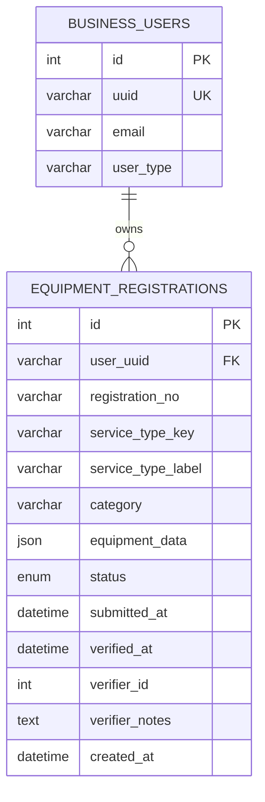

# Equipment Registration — Backend Data Strategy

## 1. Current State of Affairs

### What we have today

| Layer | What exists | Notes |
|-------|-------------|-------|
| **Frontend** | 27 service-type forms, config-driven wizard, `service-types.ts` constants | All fields are defined in `equipment-form-configs.ts` |
| **Backend framework** | CodeIgniter 4, MySQL (`new_osa` DB), JWT auth | Business users in `business_users` table, linked via `uuid` |
| **Existing equipment-like tables** | `fuel_pump_applications`, `weighing_instruments`, `capacity_measure_instruments`, `meter_instruments` | These are for **Pattern Approval** (different module), NOT for business equipment registration |
| **Business tables** | `business_users`, `business_owner_infos`, `business_contact_infos` | Business identity already established |

### The core question

> *We have 27 different service types, each with its own unique set of fields, including file uploads. How do we persist this data elegantly?*

---

## 2. The Two Architectural Options

### Option A: One Table Per Service Type (27 tables)

```
equipment_fuel_pumps         → pumpName, serialNumber, product, stickerNumber, sealNumber, ...
equipment_weighbridges       → weighbridgeName, location, maxCapacity, minCapacity, ...
equipment_fixed_storage_tanks → tankNumber, product, tankCapacity, inspectionChart_path, ...
... (× 27)
```

**Pros:**
- Each table has strongly typed, named columns
- Standard relational approach

**Cons:**
- 27 tables to create, 27 models, 27 separate migration files
- Hard to query across types (e.g., "show me ALL equipment for this business")

---

### Option B: The "One-Table" JSON Architecture (💎 Superior Solution)

```
equipment_registrations      → id, user_uuid, service_type_key, equipment_data (JSON), status, ...
```

**Pros:**
- **Only 1 table** for ALL 27 service types and all their attachments!
- Since each registration represents exactly **one equipment item**, querying, tracking lifecycles, and updating a single piece of equipment is incredibly straightforward. No nested arrays or child tables needed.
- **Files as JSON attributes**: File upload paths are stored as straightforward key-value pairs directly inside the JSON, eliminating the need for a separate documents table.
- Adding a new service type = zero database changes (just add a frontend config)
- Single query to list all equipment: `SELECT * FROM equipment_registrations WHERE user_uuid = ?`
- MySQL 8+ has native JSON functions for querying inside JSON if needed.

**Cons:**
- Can't enforce column-level NOT NULL in the DB for service-specific fields (validation moves entirely to the app layer).

---

## 3. Recommended Schema — Option B (One Table)

### Why this is the ultimate design for this project

1. **Your frontend is already config-driven.** The `EQUIPMENT_FORM_CONFIGS` object defines all 27 forms. The backend completely defers to this structure — the config IS the schema.
2. **Zero Schema Migration Overhead.** Adding service type #28 or adding a new file upload requirement to an existing form requires ZERO database changes. The backend just accepts the new key in the JSON.
3. **Cross-type queries.** The "My Equipments" page easily shows ALL equipment types in a single query since they are all rows in the same table.
4. **One Item Per Row.** By storing exactly one equipment item per row, the data model aligns natively with how WMA officers will inspect, verify, and reject items individually.

---

## 4. Table Design

### `equipment_registrations` (The Everything Table)

One row per individual equipment item. Even if a business owner registers "3 Fuel Pumps" in one go via the wizard, the backend splits them and saves **3 separate rows**. File paths uploaded during registration sit naturally inside the JSON.

```sql
CREATE TABLE `equipment_registrations` (
  `id`               INT UNSIGNED NOT NULL AUTO_INCREMENT,
  `user_uuid`        VARCHAR(32)  NOT NULL,                   -- FK → business_users.uuid
  `registration_no`  VARCHAR(50)  DEFAULT NULL,               -- Auto: EQR-2026-00001 (Unique per item)
  `service_type_key` VARCHAR(50)  NOT NULL,                   -- 'fuel-pump', 'weighbridge', etc.
  `service_type_label` VARCHAR(255) NOT NULL,                 -- 'Fuel Pump', 'Weighbridge', etc.
  `category`         VARCHAR(20)  NOT NULL,                   -- 'petroleum','weighing','length','metering','other'
  `equipment_data`   JSON         NOT NULL,                   -- ALL text fields AND file paths
  `status`           ENUM('draft','pending','verified','rejected') NOT NULL DEFAULT 'draft',
  `submitted_at`     DATETIME     DEFAULT NULL,
  `verified_at`      DATETIME     DEFAULT NULL,
  `verifier_id`      INT          DEFAULT NULL,
  `verifier_notes`   TEXT         DEFAULT NULL,
  `created_at`       DATETIME     DEFAULT CURRENT_TIMESTAMP,
  `updated_at`       DATETIME     DEFAULT CURRENT_TIMESTAMP ON UPDATE CURRENT_TIMESTAMP,
  PRIMARY KEY (`id`),
  KEY `idx_user`     (`user_uuid`),
  KEY `idx_service`  (`service_type_key`),
  KEY `idx_status`   (`status`),
  KEY `idx_category` (`category`)
) ENGINE=InnoDB DEFAULT CHARSET=utf8mb4 COLLATE=utf8mb4_unicode_ci;
```

*(Note: There is no `equipment_documents` table. It's totally unnecessary.)*

---

## 5. How `equipment_data` JSON Works

Because files are just another data point, the JSON elegantly stores both texts and paths. When a **Fixed Storage Tank** is submitted, the JSON in `equipment_data` looks like:

```json
{
  "tankNumber": "FST-001",
  "product": "diesel",
  "tankCapacity": "30000",
  "stickerNumber": "STK-6789",
  "sealNumber": "SEAL-001",
  "tankStatus": "Good",
  "lastCalibrationDate": "2026-01-10",
  "nextCalibrationDate": "2027-01-10",
  "inspectionChart": "uploads/equipments/2026/04/fst-chart-001.pdf" 
}
```
*^ See how `inspectionChart` just holds the path? Clean and perfect.*

### Querying inside JSON (MySQL 8+)

```sql
-- Find all fixed storage tanks with product = diesel
SELECT *
FROM equipment_registrations 
WHERE service_type_key = 'fixed-storage-tank'
  AND JSON_UNQUOTE(JSON_EXTRACT(equipment_data, '$.product')) = 'diesel';

-- Find ALL equipment for a business owner  
SELECT service_type_label, status, category, equipment_data
FROM equipment_registrations 
WHERE user_uuid = 'abc123'
ORDER BY created_at DESC;
```

---

## 6. API Design

### Endpoints to create

| Method | Route | Purpose |
|--------|-------|---------|
| `POST`   | `/api/business/equipments` | Submit a new equipment registration (handles array of items + files via multipart form) |
| `GET`    | `/api/business/equipments` | List all registrations for current user |
| `GET`    | `/api/business/equipments/:id` | Get registration detail |
| `PUT`    | `/api/business/equipments/:id` | Update a specific registration |
| `DELETE` | `/api/business/equipments/:id` | Delete a draft registration |

### POST payload (frontend)

Since we have files, the frontend submits via `FormData` (multipart/form-data):
- `serviceTypeKey`: "fixed-storage-tank"
- `serviceTypeLabel`: "Fixed Storage Tank"
- `category`: "petroleum"
- `items`: `[{"tankNumber":"FST-001", "product":"diesel"...}]` (Stringified JSON)
- `files[0][inspectionChart]`: `(File Blob)`

### Backend processing & saving

The backend receives the multipart form, uploads the physical files to the server, strings the new server file paths directly into the respective item's array, and splits the payload into isolated database rows:

```
equipment_registrations:
  row 1 => id=1, user_uuid='abc', service_type_key='fixed-storage-tank', equipment_data='{ "tankNumber": "FST-001", "inspectionChart": "uploads/..." }', status='pending'
  row 2 => id=2, user_uuid='abc', service_type_key='fixed-storage-tank', equipment_data='{ "tankNumber": "FST-002", "inspectionChart": "uploads/..." }', status='pending'
```

---

## 7. Backend Files to Create

### New Files

| File | Purpose |
|------|---------|
| `app/Models/EquipmentRegistrationModel.php` | The ONLY Model needed for this feature |
| `app/Controllers/Api/BusinessEquipmentController.php` | REST controller |
| `app/Database/Migrations/2026-04-10-xxx_CreateEquipmentRegistrationTable.php` | The ONLY Migration needed |

### Route additions (`app/Config/Routes.php`)

```php
// Business Equipment Registration
$routes->group('business/equipments', ['filter' => 'auth'], function($routes) {
    $routes->get('', 'BusinessEquipmentController::index');
    $routes->post('', 'BusinessEquipmentController::create');
    $routes->get('(:num)', 'BusinessEquipmentController::show/$1');
    $routes->put('(:num)', 'BusinessEquipmentController::update/$1');
    $routes->delete('(:num)', 'BusinessEquipmentController::delete/$1');
});
```

---

## 8. Entity Relationship Diagram

The diagram slims down to its purest form:



---

## 9. Validation Strategy

| Layer | What it validates |
|-------|-------------------|
| **Frontend** (already built) | Required fields, field types, formats — driven by `EQUIPMENT_FORM_CONFIGS` |
| **Backend controller** | 1. `service_type_key` must be known. 2. Extracts `items` JSON array. 3. Uploads files & injects paths into respective items. 4. Saves into `equipment_data`. |

---

## 10. Summary

| Decision | Choice |
|----------|--------|
| **Architecture** | Pure Single-Table JSON schema (The Ultimate Option B) |
| **Tables** | **1 table ONLY**: `equipment_registrations` |
| **File Uploads** | File paths are saved directly into the JSON `equipment_data` |
| **Item Granularity** | Each individual equipment item gets its own independent row |
| **Simplicity** | Completely removes the need for joins. CRUD operations are hyper-fast. |
| **Scalability** | Adding service type #28 or modifying a file requirement = **zero backend changes** |
